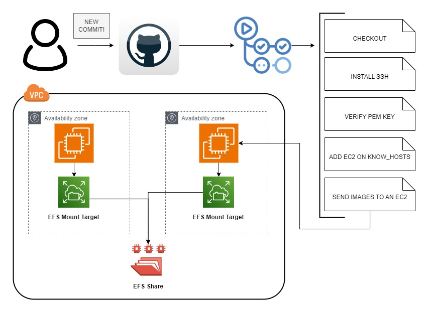

# Aula 73 - Desafio Decathlom Bikes LTDA

## TOPOLOGIA




## Passo-a-passo

- 01 Configurando Infraestrutura
    * Crie duas instâncias na AWS Cloud <br>
        * OS: Amazon Linux 2
        * VPC: ``Padrão da AWS``
        * IP: ``Habilitar IP Público``
        * Chave SSH: Utilizar a padrão do laboratório ``(labsuser.pem)`` ou criar a sua ``(.pem)``
    * Crie um EFS <br>
        * Nome: EFS-Bike
        * VPC: Utilize ``a mesma`` VPC das instâncias anteriores
        * Grupo de Segurança: ``Selecione`` o Grupo de segurança das instâncias anteriores

<br><br>

- 02 Configurando a instância
    * Acesse uma das instâncias e repita o mesmo processo para a outra
        * Criar um diretório como usuário comum (ec2-user) <br>
            * ``COMANDO``: mkdir efs
        * Instalar o ``amazon-efs-utils`` no Amazon Linux 2 <br>
            * ``COMANDO``: sudo yum install amazon-efs-utils -y
        * Instalar o ``pip3`` <br>
            * ``COMANDO``: sudo yum update -y && sudo yum install python3-pip -y
        * Atualizar a biblioteca do Python ```botocore`` <br>
            * ``COMANDO``: sudo pip3 install --upgrade botocore
        * Montar o disco na instância: <br>
            * ``COMANDO``: sudo mount -t efs <EFS-ID> efs/
        * Acesse o diretório efs e crie um arquivo <br>
            * ``COMANDO 01``: cd efs
            * ``COMANDO 02``: touch teste.txt
            * ``COMANDO 03``: cd
        * REPITA O MESMO PROCESSO PARA A OUTRA INSTÂNCIA 
        * Após repetir o mesmo processo para a outra instância, ``verifique`` se o arquivo ``teste.txt`` consta em ambas. <br><br>
        * Possíveis erros:
            * ``mount.nfs4: mounting access_point failed, reason given by server: No such file or directory``
                * Veja: Verifique se o diretório de `mount` existe e verifique se o ID do EFS está correto
            * ``Connection timed out``
                * Veja: Verifique se o grupo de segurança do EFS tem a regra `NFS` liberada para `todos`
                * OBS: Para verificar qual é o grupo de segurança do EFS, vá até o EFS criado, clique sobre ele, selecione a opção rede e role a página para o lado.
            * ``mount.nfs: Failed to resolve server file-system-id.efs.aws-region.amazonaws.com: Name or service not known. `` 
                * Veja: Se você utiliza uma VPC criada previamente verifique se a mesma tem as configurações de DNS habilitadas (ambas opções)
                * Verifique se a região da sua instância EC2 está na `MESMA` região do EFS e/ou na `MESMA VPC`
            * ``Erro de credenciais AWS``
                * O Problema pode ser que o EFS não está localizado na mesma VPC e mesma região das suas instâncias. Caso ocorra isso, recrie o EFS.
            * Outros erros diferentes dos acima, acesse: https://docs.aws.amazon.com/efs/latest/ug/troubleshooting-efs-mounting.html

<br><br>

- 03 Configurando CI/CD
    * Crie um novo repositório
        * Selecione a opção Actions e depois ``set up a workflow yourself``
        * O Conteúdo do arquivo é: ``pipeline-exemplo.yml`` que está localizado nesta documentação
        * No arquivo, não esqueça de ``substituir`` os campos ``<INSTANCE_IP>`` pelo IP de uma das instâncias e ``<INSTANCE_COMPLETE_DIRECTORIE>`` pelo diretório que o EFS compartilha
        * Envie a alteração clicando no botão verde no ```canto superior direto (Commit changes...)`` com a seguinte mensagem: ``<update>[GitActions]: Inserido CI/CD``
    * Após executar os passos anteriores crie uma nova secret com o nome ``CHAVE_PEM``
        * Acesse as configurações ``settings`` em seu repositório na Web
        * Procure pela opção: ``Secrets and Variables``
            * Selecione Actions
            * O seu ``valor`` é a key.pem que você baixou
            * Caso tenha somente a chave .ppk:
                * Acesse o PuttyGen em seu computador
                * Clique na opção Load
                * Selecione a chave que você deseja converter e clique em salvar/abrir
                * No PuttyGen no canto superior em cima clique sobre ``Convertions``
                * Clique sobre a opção ``Export OpenSSH key`` salve o arquivo com o final ``.pem``
            * Crie secret
    * Clone o repositório em sua máquina
    * Acesse o repositório clonado com o Visual Studio Code
    * No repositorio:
        * Crie um novo ```diretório`` com o nome ``images`` (Exemplo neste repositório em ``images``)
        * Baixe uma imagem de animal no Google
        * Envie-a mesma para esse diretório e envie a alteração para o seu repositório no Github
            * ``COMANDO 01``: git add .
            * ``COMANDO 02``: git commit -m "<update>[GitActions]: Inserido imagem nova"
            * ``COMANDO 03``: git push
    * Verifique se a pipeline executou com sucesso.

