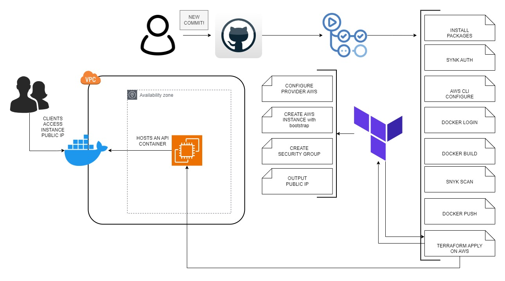

# Aula 72 - Desafio IT Ops - Melhoria Contínua 

## Topologia

## Passo-a-passo

- 01 Configurando Dockerfile
    * ``Copie`` o conteúdo do ``Dockerfile-alpine`` neste diretório e cole no ``seu`` Dockerfile localizado no seu repositório
    * Não se esqueça de salvar o arquivo e enviar as alterações para seu repositório

- 02 Configurando Terraform
    * Crie em seu repositório um arquivo chamado: ``AWS-EC2.tf``
    * ``Copie`` o conteúdo do arquivo ``AWS-EC2.tf`` neste diretório e cole no seu arquivo criado previamente
    * Não se esqueça de salvar o arquivo e enviar as alterações para seu repositório

- 03 Configurando CICD
    * ``Copie`` o conteúdo do arquivo ``pipeline-exemplo.yml`` localizado neste diretório e cole em seu arquivo de workflow ``main.yml``
    * Não se esqueça de salvar o arquivo e enviar as alterações para seu repositório

- 04 Configurando secrets no repositório
    * Em seu repositório no navegador acesse a opção ``settings``
    * Procure pela opção no menu ``Secrets and Variables``
    * Crie as seguintes secrets com seu respectivo valor (OBS: O Valor você pode pegar no próprio AWS Sandbox na opção ``AWS Details`` e procure por ``CLI``):
        * ``AWS_ACCESS_KEY_ID`` = AWS Access key ID
        * ``AWS_SECRET_ACCESS_KEY`` = AWS Secret Access key ID
        * ``DOCKER_PASSWORD`` = Sua senha do Docker
        * ``DOCKER_USER`` = Seu usuário do Docker
        * ``REGISTRY`` = https://hub.docker.com/
        * ``SNYK_AUTH_TOKEN`` = Token da ferramenta SNYK 
        * ``SSH_KEY_VOCKEY`` = Valor da chave SSH

- 05 Testando pipeline
    * No seu Visual Studio Code, no Dockerfile, procure pelas ``linhas comentadas``, começam com ``#`` e acrescente uma letra qualquer e envie a alteração:
        * ``COMANDO 01``: git add .
        * ``COMANDO 02``: git commit -m "<update>[GitActions]: Testando pipeline"
        * ``COMANDO 03``: git push
