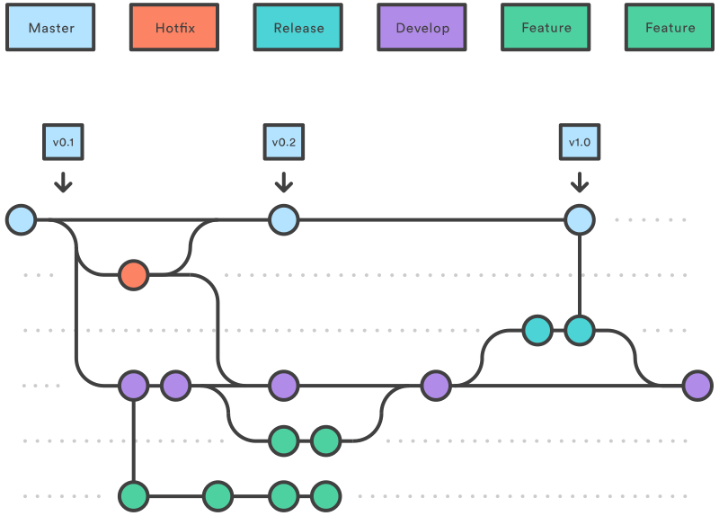

# Aula ?? - GitHub Actions - SENAI Paulo Antonio Skaf


> Curso Técnico Em Redes de Computadores

## Index
* [Sobre os instrutores](#sobre-os-instrutores)
* [01 - O que é o Github](#01---o-que-é-o-github)
* [02 - O que é e o porque de usar GitFlow](#02---o-que-é-e-o-porque-de-usar-gitflow)
* [03 - O que é DevOps?](#03---o-que-é-devops)
* [04 - O que é Github Actions?](#04---o-que-é-github-actions)
* [05 - Na prática (Tutorial)](#05---na-prática-tutorial)

<br><br>

## Sobre os Instrutores
| Nome | GitHub | Escola |
| ---| ---| ---|
|Danilo Sibov|https://github.com/FofuxoSibov|SENAI de Informática - 1.34
|José Silva|https://github.com/cl0uD-C1SC0|SENAI de Informática - 1.34
|Fernando de Oliveira|https://github.com/FernandodOFy|SENAI de Informática - 1.34

```python
print("SENAI PAULO ANTONIO SKAF! Olá Mundo!")
```

# 01 - O que é Git e Github??

<h3>

> O Git é um sistema de controle de versão distribuído, projetado para lidar com projetos de qualquer tamanho com rapized e eficiência. Ele foi criado por Linus Torvalds em 2005 para o desenvolvimento do Kernel do Linux, e desde então se tornou uma ferramenta amplamente utilizada em todo o mundo para o gerenciamento de código-fonte. 

> O Github ele é uma das diversas plataformas (lista abaixo) de hospedagem de código-fonte e colaboração para desenvolvimento de software baseado em controle de versão Git. Em suma, é um lugar onde desenvolvedores podem armazenar, compartilhar e colaborar em projetos de software de forma eficiente. Ele oferece recursos como controle de versão, gerenciamento de problemas, solicitações de pull e integração contínua, tornando-o uma ferramenta essencial para o desenvolvimento de software em equipe. 
</h3> <br>

<div align="center">
    
    
    
    
</div>
<br><br>

# 02 - O que é e o porque de usar Gitflow?

<h2>

> O Gitflow é um modelo de ramificação (branchs) para o controle de versão utilizando o Git. Ele define um conjunto de diretrizes e boas práticas para organizar o fluxo de trabalho em projetos de desenvolvimento de software. O Gitflow foi criado por Vincent Driessen em 2010 e desde então se tornou bastante popular devido à sua clareza e eficácia em projetos de diferentes tamanhos.

> O Gitflow é baseado na ideia de manter dois ramos principais permanentes: master e develop, e utiliza ramos temporários para o desenvolvimento de funcionalidades (feature), correções de bugs (hotfix), lançamentos (release), e versões específicas (support). Aqui está uma breve descrição de cada ramificação principal:

</h2>

<h3>

* <span style="color:yellow;"> Master:</span> Este ramo é onde a versão mais estável do software reside. Ele só deve conter código que está pronto para ser implantado em produção. Normalmente, é a partir deste ramo que novas versões são criadas.

* <span style="color:yellow;"> Develop:</span> Este é o ramo principal de desenvolvimento, onde o trabalho diário ocorre. Todas as novas funcionalidades e correções de bugs são mescladas para este ramo. É a partir deste ramo que novas funcionalidades são desenvolvidas.

<br>

> Além desses ramos principais, o Gitflow define outros tipos de ramos para diferentes propósitos:


* <span style="color:yellow;"> Feature branches:</span> Ramos criados a partir do ramo develop para desenvolver novas funcionalidades. Uma vez concluídas, elas são mescladas de volta ao develop.


* <span style="color:yellow;"> Release branches:</span> Ramos criados a partir do develop quando uma nova versão está sendo preparada. Eles são usados para preparar o código para um novo lançamento, como correções finais de bugs e atualizações de documentação. Uma vez que a versão está pronta, ela é mesclada tanto no master quanto no develop.

* <span style="color:yellow;"> Hotfix branches:</span> Ramos criados a partir do master para corrigir bugs críticos que foram encontrados na produção. Eles são usados para aplicar correções rápidas que precisam ser implantadas imediatamente. Após a correção, o código é mesclado tanto no master quanto no develop.

</h3> <br>
<div align="center">

</div>
<br><br><br>

# 03 - O que é DevOps?

<h2>

> DevOps é uma cultura, prática e abordagem de colaboração entre equipes de desenvolvimento de software (Dev) e operações de TI (Ops). O termo "DevOps" é uma combinação das palavras "development" (desenvolvimento) e "operations" (operações). O principal objetivo do DevOps é reduzir o ciclo de vida do desenvolvimento de software, desde o planejamento e desenvolvimento até o teste, entrega e operações, promovendo uma entrega de software mais rápida, frequente e confiável.

> A cultura DevOps enfatiza a colaboração, automação, integração contínua, entrega contínua, monitoramento e feedback contínuo. Algumas das práticas e princípios chave do DevOps incluem:

</h2>

<h3>

* <span style="color:yellow;"> Automação:</span> Automação de processos manuais para acelerar o desenvolvimento, teste e entrega de software, reduzindo erros humanos e aumentando a consistência.

* <span style="color:yellow;"> Integração Contínua (CI):</span> Prática de integrar o código de vários desenvolvedores em um repositório compartilhado várias vezes ao dia. Isso permite identificar e corrigir problemas de integração rapidamente.

* <span style="color:yellow;"> Entrega Contínua (CD):</span> Prática de automatizar o processo de entrega de software para garantir que o código possa ser implantado em produção a qualquer momento de maneira rápida e confiável.

* <span style="color:yellow;"> Infraestrutura como Código (IaC):</span> Prática de gerenciar a infraestrutura de TI usando código, o que permite provisionar e configurar recursos de forma consistente e reprodutível.

* <span style="color:yellow;"> Monitoramento Contínuo:</span> Prática de monitorar continuamente o desempenho, disponibilidade e integridade do software em produção, permitindo identificar e resolver problemas rapidamente.

* <span style="color:yellow;"> Colaboração e Compartilhamento:</span> Fomentar uma cultura de colaboração entre equipes de desenvolvimento, operações e outras partes interessadas, promovendo a comunicação e o compartilhamento de conhecimento.

</h3>
<br><br><br>

## 04 - O que é Github Actions?

<h2>

> GitHub Actions é um serviço de automação fornecido pelo GitHub que permite automatizar fluxos de trabalho dentro do ciclo de vida do desenvolvimento de software. Com o GitHub Actions, você pode criar fluxos de trabalho personalizados para automatizar tarefas como construção, teste, implantação e qualquer outra atividade que você deseje automatizar em seu repositório do GitHub.
<br><br>As principais características do GitHub Actions incluem:

</h2>

<h3>

* <span style="color:yellow;">Fluxos de trabalho YAML:</span> Os fluxos de trabalho são definidos em arquivos YAML dentro do seu repositório do GitHub. Isso permite que você descreva suas automações de forma clara e controlada por versão.

* <span style="color:yellow;">Eventos do GitHub:</span> Os fluxos de trabalho são acionados por eventos específicos do GitHub, como push de código, criação de pull requests, lançamentos de versões, comentários em issues, entre outros. Isso permite que você automatize suas ações em resposta a atividades específicas no GitHub.

* <span style="color:yellow;">Executores e ações:</span> Os fluxos de trabalho são executados em executores específicos (como Linux, macOS ou Windows) e podem incluir uma série de ações predefinidas ou personalizadas. As ações são pequenas tarefas que podem ser combinadas para criar fluxos de trabalho complexos.

* <span style="color:yellow;">Integração contínua e entrega contínua (CI/CD):</span> Você pode usar o GitHub Actions para configurar pipelines de CI/CD completos, onde seu código é automaticamente construído, testado e implantado em ambientes de produção sempre que houver uma alteração no repositório.

* <span style="color:yellow;">Integração com o ecossistema do GitHub:</span> O GitHub Actions é profundamente integrado com o ecossistema do GitHub, permitindo que você acesse facilmente seus repositórios, problemas, pull requests e outras informações do GitHub diretamente em seus fluxos de trabalho.

</h3>
<br><br><br>

## 05 - Na prática (Tutorial)


<br><br><br>
<div align="center">
<p>SENAI São Caetano do Sul - Informática - Escola Senai "Paulo Antonio Skaf"</p>
<p>Endereço: Rua Niteroi, 180 - Centro - São Caetano do Sul/SP</p>
<p>Copyright 2024 © Todos os direitos reservados.</p>
</div>

